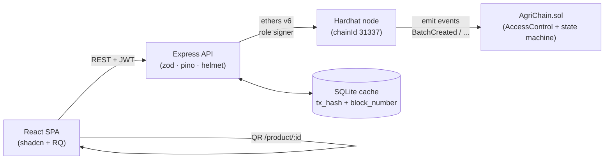

# AgriChain — on-chain supply trust for agricultural produce

A hybrid dApp that tracks a crop from farm to shelf on an Ethereum-compatible
blockchain. Each stakeholder (farmer, processor, logistics, retailer) signs a
role-gated transaction that adds their contribution to the price. Consumers
scan a QR and see the entire provenance + price breakdown on-chain.

Stack: **React 19 + Vite + Tailwind v4 + shadcn + React Query + Recharts** on
the frontend, **Express 5 + SQLite + ethers v6** on the backend, **Solidity
0.8.28 + OpenZeppelin AccessControl + Hardhat** for the contract.

## Architecture



Role signers (derived from one `MNEMONIC`): `accounts[1]` = FARMER, `[2]` =
PROCESSOR, `[3]` = LOGISTICS, `[4]` = RETAILER. The admin wallet
(`accounts[0]`) holds `DEFAULT_ADMIN_ROLE` and grants the other roles at
deploy time. The frontend never touches a key — it authenticates to the API
with a JWT and the API signs on the user's behalf.

## 60-second quickstart

```bash
npm install                           # root frontend deps
npm --prefix smart-contract install   # hardhat + OZ
npm --prefix backend install          # express + ethers + jwt

npm run dev                           # starts chain + deploy + backend + web
# …in a second terminal, once all four processes are up:
npm run seed                          # 6 demo users + 5 staggered batches
```

Open <http://localhost:5173> and sign in with any demo account (password
`demo12345`):

| Role | Email |
|---|---|
| Farmer | `farmer@demo.agri` |
| Processor | `processor@demo.agri` |
| Logistics | `logistics@demo.agri` |
| Retailer | `retailer@demo.agri` |
| Admin | `admin@demo.agri` |
| Consumer | `consumer@demo.agri` |

Then walk the demo: create a batch as farmer → switch to processor and add
a processing fee → logistics ship → retailer receive → publish QR → visit
`/scan` and type the batch id. Every step shows the tx hash and block
number next to the price component.

## npm scripts (root)

| Script | What it does |
|---|---|
| `npm run dev` | Starts Hardhat node, deploys the contract, starts backend, starts Vite — all in one terminal via `concurrently`. |
| `npm run chain` | Just `hardhat node`. |
| `npm run deploy` | Deploys `AgriChain.sol`, grants role signers, rewrites `backend/.env` and root `.env`. |
| `npm run backend` | Just the Express API (`node server.js`). |
| `npm run frontend` | Just Vite (`vite`). |
| `npm run seed` | Wipes the SQLite cache and reseeds 6 demo users + 5 demo batches. |
| `npm run reset` | Deletes the DB, redeploys the contract, reseeds. Recovery path. |
| `npm test` | Runs the Hardhat test suite (17 cases). |
| `npm run build` | Production Vite build. |
| `npm run typecheck` | `tsc --noEmit` over the frontend. |

## Project layout

```
Blockchain-Agri/
├─ smart-contract/          Hardhat 3 project
│  ├─ contracts/AgriChain.sol        AccessControl + enum state machine
│  ├─ scripts/deploy.js              Deploys + grants roles + writes .envs
│  └─ test/AgriChain.test.js         17 cases incl. role + state reverts
├─ backend/                 Express 5 API
│  ├─ server.js, routes/auth.js, routes/api.js
│  ├─ middleware/{auth,requireRole,validate}.js
│  ├─ lib/{config,wallets,errors,logger}.js
│  ├─ database/{db.js, schema.sql}
│  └─ scripts/seed.js                6 users + 5 staggered batches
├─ src/                     React 19 SPA
│  ├─ pages/                LandingPage, Login, Register, role dashboards,
│  │                         ConsumerScan, ConsumerBatchDetails, NotFound
│  ├─ components/ui/         shadcn primitives (card, dialog, sheet, …)
│  ├─ components/batches/   BatchTable, BatchDetailsSheet, QRPublishDialog …
│  ├─ components/layout/    DashboardShell
│  ├─ components/common/    TxHashChip, StatusBadge, EmptyState, ErrorBoundary
│  ├─ providers/            QueryProvider, AuthProvider
│  ├─ hooks/                useAuth, useBatches
│  └─ lib/api.ts            typed fetch client
└─ docs/SHIP_PLAN.md        Phase-by-phase ship plan with progress tracker
```

## Environment

Running `npm run deploy` rewrites these files automatically; you usually
don't touch them by hand.

**Root `.env`** (Vite picks these up):

```
VITE_API_BASE_URL=http://localhost:3001
VITE_CHAIN_NAME=Hardhat #31337
VITE_CONTRACT_ADDRESS=0x…
```

**`backend/.env`**:

```
PORT=3001
FRONTEND_URL=http://localhost:5173
BLOCKCHAIN_URL=http://127.0.0.1:8545
CONTRACT_ADDRESS=0x…
MNEMONIC=test test test test test test test test test test test junk
JWT_SECRET=dev-secret-change-me-in-production
```

The default `MNEMONIC` is the standard Hardhat test phrase. It's safe
for localhost only — never use it on a public network.

## API surface (all under `/api`)

| Method | Path | Auth | Role | Notes |
|---|---|---|---|---|
| POST | `/auth/register` | — | — | rate-limited, returns `{token,user}` |
| POST | `/auth/login` | — | — | rate-limited |
| GET | `/auth/me` | JWT | any | |
| POST | `/batch/create` | JWT | FARMER | creates batch on-chain |
| POST | `/batch/process` | JWT | PROCESSOR | adds processing fee |
| POST | `/batch/ship` | JWT | LOGISTICS | marks in transit |
| POST | `/batch/receive` | JWT | RETAILER | applies retail markup |
| POST | `/batch/update` | JWT | role-matching | legacy dispatcher |
| GET | `/batch/:id` | — | — | public consumer read |
| GET | `/batches` | — | — | public, optional `?status=` |
| GET | `/stats/count` | — | — | on-chain batch count |
| GET | `/admin/overview` | JWT | ADMIN | stats + volume series + activity |

Every write response has the DB shape (`total_price`, `farmer_address`, full
`priceBreakdown`) **plus** `{ txHash, blockNumber, contractAddress }` so the
frontend can display on-chain proof inline.

## Security notes (what changed vs. the v0 baseline)

- **Contract**: OpenZeppelin `AccessControl` gates every write; `Status`
  enum + `require` guards prevent state skipping. 17 tests incl. wrong-role
  and out-of-order reverts.
- **Backend**: JWT Bearer auth with bcryptjs password hashing, zod
  validation at the API boundary, `requireRole` per route, helmet CSP
  headers, `cors({origin:FRONTEND_URL})`, `express-rate-limit` on auth and
  write routes, structured `{success, error:{code,message}}` envelope.
- **DB-chain sync**: writes go to chain first (`await tx.wait()`), then
  DB — so a revert leaves no orphan row. `tx_hash` is captured on both
  `batches` and `price_components`.

## Deploying to a public testnet (optional)

The plan intentionally ships against local Hardhat. To deploy to Polygon
Amoy or Base Sepolia:

1. Add a network to `smart-contract/hardhat.config.js`:
   ```js
   networks: {
     amoy: { type: "http", url: process.env.AMOY_RPC_URL, accounts: [process.env.DEPLOYER_PK] },
   }
   ```
2. Fund the deployer wallet from the Amoy faucet.
3. Run `npm run deploy --network=amoy` and update `BLOCKCHAIN_URL`,
   `MNEMONIC` (or switch to explicit `PRIVATE_KEY`), and `CONTRACT_ADDRESS`
   in `backend/.env`.
4. Rotate `JWT_SECRET` for production. Consider moving off the default
   mnemonic — in a real deployment each role would use its own key or
   connect its own wallet.

## Ship-ready plan

The staged rewrite from the baseline MVP to what you see now is documented
phase-by-phase in [`docs/SHIP_PLAN.md`](./docs/SHIP_PLAN.md), including a
progress tracker table at the top.
