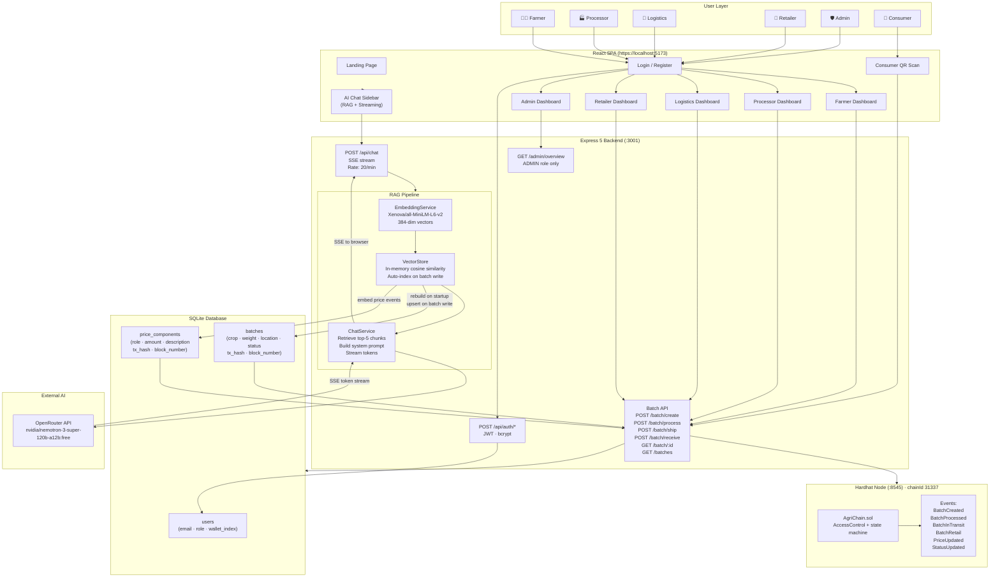

# AgriChain — On-Chain Supply Trust for Agricultural Produce

AgriChain is a full-stack hybrid dApp that tracks every crop batch from farm to retail shelf on a local Ethereum-compatible blockchain. Each stakeholder in the supply chain — farmer, processor, logistics operator, retailer — signs a role-gated transaction that records their contribution, fee, and timestamp immutably on-chain. Consumers scan a QR code and see the complete provenance and transparent price breakdown, with every step backed by a real blockchain transaction hash and block number.

Built as a v2 ground-up rewrite with production-grade security, a RAG-powered AI assistant, and a polished role-aware UI.

---

## Table of Contents

- [Architecture Overview](#architecture-overview)
- [System Flowchart](#system-flowchart)
- [Smart Contract](#smart-contract)
- [Backend API](#backend-api)
- [AI Chatbot (RAG)](#ai-chatbot-rag)
- [Frontend](#frontend)
- [Database Schema](#database-schema)
- [Supply Chain State Machine](#supply-chain-state-machine)
- [Roles & Permissions](#roles--permissions)
- [API Reference](#api-reference)
- [Project Layout](#project-layout)
- [Quickstart](#quickstart)
- [npm Scripts](#npm-scripts)
- [Environment Variables](#environment-variables)
- [Security Architecture](#security-architecture)
- [Deploying to a Public Testnet](#deploying-to-a-public-testnet)

---

## Architecture Overview

AgriChain has four independent layers that communicate through well-defined interfaces:

```
┌─────────────────────────────────────────────────────────────────────┐
│  React 19 SPA  (Vite + Tailwind v4 + shadcn + React Query)          │
│  ┌──────────────┐  ┌─────────────────────┐  ┌───────────────────┐  │
│  │ Role Dashboards│  │ Consumer QR Scan     │  │ AI Chat Sidebar   │  │
│  │ Farmer/Proc/  │  │ /scan → /product/:id │  │ (RAG, streaming)  │  │
│  │ Logistics/    │  └─────────────────────┘  └───────────────────┘  │
│  │ Retailer/Admin│                                                    │
│  └──────────────┘                                                    │
└──────────────────────────────┬──────────────────────────────────────┘
                    REST + JWT  │  POST /api/chat (SSE)
┌──────────────────────────────▼──────────────────────────────────────┐
│  Express 5 Backend  (Node.js · zod · pino · helmet · rate-limit)    │
│  ┌──────────┐  ┌──────────┐  ┌──────────────────────────────────┐  │
│  │ Auth     │  │ Batch    │  │ RAG Chat Pipeline                 │  │
│  │ Routes   │  │ Routes   │  │ EmbeddingService (all-MiniLM-L6)  │  │
│  │ JWT+bcrypt│  │ 5 writes │  │ VectorStore (cosine sim, in-mem)  │  │
│  └──────────┘  │ 3 reads  │  │ ChatService → OpenRouter SSE      │  │
│                └──────────┘  └──────────────────────────────────┘  │
│  ┌──────────────────────┐    ┌───────────────────────────────────┐  │
│  │ SQLite Cache          │    │ ethers v6 Role Signers             │  │
│  │ batches + price_comps│    │ accounts[1..4] from MNEMONIC       │  │
│  └──────────────────────┘    └─────────────────┬─────────────────┘  │
└────────────────────────────────────────────────┼────────────────────┘
                                    JSON-RPC      │
┌───────────────────────────────────────────────▼────────────────────┐
│  Hardhat Node  (chainId 31337 · localhost:8545)                     │
│  ┌──────────────────────────────────────────────────────────────┐  │
│  │ AgriChain.sol                                                 │  │
│  │ AccessControl  ·  Status enum state machine                   │  │
│  │ FARMER_ROLE · PROCESSOR_ROLE · LOGISTICS_ROLE · RETAILER_ROLE│  │
│  │ Events: BatchCreated · BatchProcessed · BatchInTransit ·      │  │
│  │         BatchRetail · PriceUpdated · StatusUpdated            │  │
│  └──────────────────────────────────────────────────────────────┘  │
└─────────────────────────────────────────────────────────────────────┘
                                    │
                     OpenRouter API │  (nvidia/nemotron-3-super-120b)
                                    ▼
                         https://openrouter.ai
```

---

## System Flowchart



---

## Smart Contract

**`smart-contract/contracts/AgriChain.sol`** — Solidity 0.8.28 + OpenZeppelin AccessControl

### Role Architecture

The contract uses OpenZeppelin `AccessControl`. Four role constants are defined:

```solidity
bytes32 public constant FARMER_ROLE    = keccak256("FARMER_ROLE");
bytes32 public constant PROCESSOR_ROLE = keccak256("PROCESSOR_ROLE");
bytes32 public constant LOGISTICS_ROLE = keccak256("LOGISTICS_ROLE");
bytes32 public constant RETAILER_ROLE  = keccak256("RETAILER_ROLE");
```

At deploy time the admin wallet (`accounts[0]`) holds `DEFAULT_ADMIN_ROLE` and grants each of the four role constants to the corresponding backend-controlled HD signer wallet (`accounts[1..4]`). The frontend never touches a private key — it sends a JWT-authenticated REST request to the backend, which signs the on-chain transaction on the user's behalf.

### State Machine

```
CREATED ──→ PROCESSED ──→ IN_TRANSIT ──→ RETAIL ──→ SOLD
```

Each state transition is enforced by `require` guards in the contract. Calling `addProcessing` on a batch that isn't `CREATED` reverts. Calling `retailerReceive` before the batch is `IN_TRANSIT` reverts. Out-of-order writes are impossible.

### Batch & PriceComponent Structs

```solidity
struct PriceComponent {
    address stakeholder;
    string role;
    uint256 amount;
    string description;
    uint256 timestamp;
}

struct Batch {
    uint256 id;
    address farmer;
    string crop;
    string weight;
    string location;
    uint256 createdAt;
    Status status;
    uint256 totalPrice;
    PriceComponent[] priceBreakdown;
}
```

Every batch stores its full price history as a `PriceComponent[]` array on-chain. Each write appends one entry. `totalPrice` accumulates.

### Events

```solidity
event BatchCreated(uint256 indexed id, address indexed farmer, uint256 basePrice);
event BatchProcessed(uint256 indexed id, address indexed processor, uint256 fee, uint256 newTotal);
event BatchInTransit(uint256 indexed id, address indexed logistics, uint256 fee, uint256 newTotal);
event BatchRetail(uint256 indexed id, address indexed retailer, uint256 markup, uint256 newTotal);
event PriceUpdated(uint256 indexed id, address indexed stakeholder, string role, uint256 amount, uint256 newTotal);
event StatusUpdated(uint256 indexed id, Status newStatus);
```

### Test Suite

17 test cases in `smart-contract/test/AgriChain.test.js` using Hardhat + Chai:
- Role-gated access: wrong-role reverts on every write function
- State machine: out-of-order transition reverts
- Happy path: full CREATED → PROCESSED → IN_TRANSIT → RETAIL lifecycle
- Price accumulation: verified at each step
- AccessControl: grant/revoke role by admin

---

## Backend API

**`backend/server.js`** — Express 5, Node.js, CommonJS

### Startup Sequence

1. Load `.env` → validate required vars (`MNEMONIC`, `JWT_SECRET`)
2. `assertChainReady()` — connects to Hardhat node, reads `CONTRACT_ADDRESS`, verifies the contract exists
3. Start HTTP server on `PORT` (default 3001)
4. Non-blocking: `vectorStore.rebuild()` — embeds all existing batches into the in-memory vector index

### Middleware Stack (all routes)

```
helmet (CSP + security headers)
  → cors
    → express.json (200kb limit)
      → pino-http (structured request logging)
        → route handlers
          → errorHandler (AppError → {success,error:{code,message}})
```

### Authentication

All authenticated routes use `auth.js` middleware:
- Reads `Authorization: Bearer <token>` header
- Verifies JWT with `config.jwtSecret`
- Attaches `{ id, email, role, walletIndex }` to `req.user`
- Returns `401 UNAUTHORIZED` if missing or invalid

The `/api/chat` route uses `optionalAuth.js`:
- Same logic but sets `req.user = null` if no token — does not 401
- Allows public consumers to use the chatbot without logging in

### Write Flow (all batch mutations)

```
1. JWT auth → requireRole check
2. zod schema validation (body)
3. Call blockchain.js → ethers v6 → signed tx → await tx.wait()
4. Get full batch from contract (blockchain.getBatchDetails)
5. dbHelpers.upsertBatch() → SQLite
6. dbHelpers.insertPriceComponent() → SQLite
7. vectorStore.upsert(batchId) → re-embed for RAG (non-blocking)
8. Return { batch + priceBreakdown + txHash + blockNumber + contractAddress }
```

Writes go to the chain **before** the DB. If the chain reverts, no SQLite row is written. No orphan data.

### Read Flow

- `/batch/:id` — hits SQLite first (fast), falls back to on-chain query if not cached
- `/batches` — SQLite only, with optional `?status=` filter
- `/admin/overview` — 4 parallel SQLite aggregation queries

---

## AI Chatbot (RAG)

AgriChain includes a production-grade RAG (Retrieval-Augmented Generation) chatbot backed by a local neural embedding model and the OpenRouter API.

### How It Works

```
User message
    │
    ▼
EmbeddingService.encode(message)
    │  Xenova/all-MiniLM-L6-v2 (384-dim)
    ▼
VectorStore.search(queryVector, k=5)
    │  cosine similarity across all indexed batch documents
    │  returns top-5 most relevant chunks with scores
    ▼
ChatService.buildMessages(systemPrompt, chunks, history, message)
    │  assembles: system prompt + retrieved context + last 8 turns + user message
    ▼
OpenRouter API  (nvidia/nemotron-3-super-120b-a12b:free)
    │  stream: true → SSE token stream
    ▼
Express SSE response  →  React ReadableStream  →  token-by-token UI
```

### Embedding Service

- Model: `Xenova/all-MiniLM-L6-v2` via `@xenova/transformers` (pure JS, no Python)
- Downloaded once (~22MB) on first run, cached locally
- Lazy initialization — server starts immediately, model loads in background
- Output: 384-dimensional float vector (mean-pooled, L2-normalized)

### Vector Store

- Pure in-memory array of `{ id, text, vector, metadata }` entries
- **`rebuild()`**: called on server start — queries all batches + price_components, formats documents, encodes all, stores in-memory
- **`upsert(batchId)`**: called after every batch write — re-encodes only the affected batch, updates or adds its entry
- **`search(queryVector, k)`**: cosine similarity across all entries, returns top-K sorted by score

### Document Format

Each batch is serialized as a rich text document before embedding:

```
Batch #5 | Crop: Wheat | Weight: 100kg | Location: Punjab, India
Status: AT_RETAILER | Total Price: 1500 units
Farmer Wallet: 0x70997970C51812dc3A010C7d01b50e0d17dc79C8
Created: 2024-01-15T10:30:00.000Z | Last Updated: 2024-01-20T14:22:00.000Z
Blockchain TX (creation): 0x24193955... | Block: 6
Contract Address: 0x5FbDB2315678afecb367f032d93F642f64180aa3

Supply Chain Journey:
  [1] FARMER | Wallet: 0x70997970... | +800 units | "base price"
      TX: 0x24193955... | Block: 6 | Time: 2024-01-15T10:30:00.000Z
  [2] PROCESSOR | Wallet: 0x3C44CdDd... | +200 units | "cleaning and grading"
      TX: 0xe9509c57... | Block: 7 | Time: 2024-01-16T09:15:00.000Z
  [3] LOGISTICS | Wallet: 0x90F79bf6... | +300 units | "transport to Delhi hub"
      TX: 0xfed321ab... | Block: 12 | Time: 2024-01-17T16:45:00.000Z
  [4] RETAILER | Wallet: 0x15d34AAe... | +200 units | "retail markup"
      TX: 0xabc789de... | Block: 28 | Time: 2024-01-20T14:22:00.000Z
```

### System Prompt

The LLM receives full platform context:
- AgriChain role definitions (FARMER, PROCESSOR, LOGISTICS, RETAILER, ADMIN, CONSUMER)
- Instruction: never invent batch IDs, wallets, or prices not in context
- Authenticated user's role + email (when JWT present) for "my batches" queries
- Up to 5 retrieved batch documents as grounding context
- Last 8 conversation turns for multi-turn memory

### Chat Endpoint

```
POST /api/chat
Content-Type: application/json
Authorization: Bearer <token>  (optional)

{
  "message": "Show me all batches at retail stage",
  "history": [
    { "role": "user", "content": "..." },
    { "role": "assistant", "content": "..." }
  ]
}

Response: text/event-stream
data: {"token":"Here are the batches..."}\n\n
data: {"token":" currently at"}\n\n
...
data: {"done":true}\n\n
```

Rate limited: 20 requests/minute per IP.

### Frontend Chat UI

- **ChatSidebar**: 380px slide-in panel from right, CSS `transform: translateX` animation
- **Empty state**: 3 role-aware suggested questions (different per FARMER/PROCESSOR/LOGISTICS/RETAILER/ADMIN/public)
- **Streaming**: tokens append in real-time, blinking `▌` cursor while streaming
- **Markdown rendering**: `react-markdown` + `remark-gfm` — tables, lists, bold, code blocks, headings all rendered properly
- **Multi-turn**: last 16 messages sent with every request for conversation continuity
- **Abort**: in-flight streams cancelled when sidebar is closed
- **Toggle**: "Ask AI" button in DashboardShell header (all role dashboards)

---

## Frontend

**`src/`** — React 19, TypeScript, Vite 6, Tailwind CSS v4

### Pages

| Page | Path | Access |
|---|---|---|
| LandingPage | `/` | public |
| Login | `/login` | public |
| Register | `/register` | public |
| FarmerDashboard | `/farmer/*` | FARMER only |
| ProcessorDashboard | `/processor/*` | PROCESSOR only |
| LogisticsDashboard | `/logistics/*` | LOGISTICS only |
| RetailerDashboard | `/retailer/*` | RETAILER only |
| AdminDashboard | `/admin/*` | ADMIN only |
| ConsumerScan | `/scan` | public |
| ConsumerBatchDetails | `/product/:batchId` | public |
| NotFound | `*` | public |

### Provider Tree

```
ChatProvider          ← sidebar open/close state
  QueryProvider       ← TanStack Query client
    AuthProvider      ← JWT token, user object, login/logout
      TooltipProvider
        BrowserRouter
          Routes
          ChatSidebar ← renders outside routes, persists across navigation
          Toaster
```

### Key Components

**`DashboardShell`** — shared layout wrapper for all role dashboards:
- Left sidebar (desktop) / hamburger drawer (mobile) with role-specific nav
- Top header bar with chain status badge, actions slot, "Ask AI" button, user dropdown
- Role icon + workspace label per role
- Contract address footer

**`BatchTable`** — paginated table of batches with status badge, tx hash chip, price breakdown expand

**`BatchDetailsSheet`** — Radix Sheet drawer showing full batch details, supply chain timeline, QR code

**`QRPublishDialog`** — generates QR code for `/product/:batchId` consumer URL

**`TxHashChip`** — truncated tx hash with copy-to-clipboard, links to block explorer

**`StatusBadge`** — color-coded badge for CREATED / PROCESSED / IN_TRANSIT / RETAIL / SOLD

**`ChatSidebar`** / **`ChatMessage`** / **`ChatInput`** — AI chatbot UI (see RAG section)

### State Management

- **Server state**: TanStack Query (`useQuery`, `useMutation`) with typed API client (`src/lib/api.ts`)
- **Auth state**: React context (`AuthProvider`) — token persisted to `localStorage`
- **Chat state**: local component state in `useChat` hook — ephemeral, not persisted
- **Sidebar state**: React context (`ChatProvider`) — toggled from DashboardShell

---

## Database Schema

SQLite database at `backend/database/agrichain.db`.

```sql
CREATE TABLE users (
    id            INTEGER PRIMARY KEY AUTOINCREMENT,
    email         TEXT NOT NULL UNIQUE,
    password_hash TEXT NOT NULL,
    role          TEXT NOT NULL,          -- FARMER|PROCESSOR|LOGISTICS|RETAILER|ADMIN|CONSUMER
    wallet_index  INTEGER,                -- HD path index for backend signer
    created_at    INTEGER NOT NULL        -- Unix ms
);

CREATE TABLE batches (
    id              INTEGER PRIMARY KEY,  -- matches on-chain batch ID
    farmer_address  TEXT NOT NULL,
    crop            TEXT NOT NULL,
    weight          TEXT NOT NULL,
    location        TEXT NOT NULL,
    status          TEXT NOT NULL,        -- mirrors on-chain Status enum
    total_price     INTEGER NOT NULL,
    tx_hash         TEXT,                 -- creation tx
    block_number    INTEGER,
    created_at      INTEGER NOT NULL,     -- Unix ms
    updated_at      INTEGER NOT NULL      -- Unix ms
);

CREATE TABLE price_components (
    id                  INTEGER PRIMARY KEY AUTOINCREMENT,
    batch_id            INTEGER NOT NULL REFERENCES batches(id),
    stakeholder_address TEXT NOT NULL,
    role                TEXT NOT NULL,    -- FARMER|PROCESSOR|LOGISTICS|RETAILER
    amount              INTEGER NOT NULL,
    description         TEXT,
    timestamp           INTEGER NOT NULL, -- Unix ms
    tx_hash             TEXT,
    block_number        INTEGER
);
```

The DB is a **write-through cache** — the source of truth is always the blockchain. The SQLite layer exists for fast reads (avoiding slow `eth_call` per page load). Every batch write goes to chain first, then DB. If the chain reverts, no DB row is written.

---

## Supply Chain State Machine

```
            createBatch()           addProcessing()
FARMER ──────────────────▶ CREATED ─────────────────▶ PROCESSED
                                                           │
                                               updateLogistics()
                                                           │
                                                     IN_TRANSIT
                                                           │
                                               retailerReceive()
                                                           │
                                                        RETAIL
                                                           │
                                               (future: markSold)
                                                           │
                                                         SOLD
```

Each arrow is a separate on-chain transaction, signed by the respective role wallet. Any attempt to skip a stage reverts with a descriptive error. The backend enforces the same order through `requireRole` middleware.

---

## Roles & Permissions

| Role | Wallet | On-chain function | Backend endpoint |
|---|---|---|---|
| FARMER | `accounts[1]` | `createBatch()` | `POST /api/batch/create` |
| PROCESSOR | `accounts[2]` | `addProcessing()` | `POST /api/batch/process` |
| LOGISTICS | `accounts[3]` | `updateLogistics()` | `POST /api/batch/ship` |
| RETAILER | `accounts[4]` | `retailerReceive()` | `POST /api/batch/receive` |
| ADMIN | `accounts[0]` | `DEFAULT_ADMIN_ROLE` | `GET /api/admin/overview` |
| CONSUMER | — | read-only | `GET /api/batch/:id` |

Wallets are derived from one `MNEMONIC` using BIP-44 HD paths (`m/44'/60'/0'/0/{0..4}`). The deploy script grants each role constant to the corresponding address at deploy time.

---

## API Reference

All responses use the envelope:

```json
{ "success": true, "data": { ... } }
{ "success": false, "error": { "code": "VALIDATION_ERROR", "message": "..." } }
```

### Auth

| Method | Path | Auth | Body | Returns |
|---|---|---|---|---|
| POST | `/api/auth/register` | — | `{email, password, role}` | `{token, user}` |
| POST | `/api/auth/login` | — | `{email, password}` | `{token, user}` |
| GET | `/api/auth/me` | JWT | — | `{user}` |

### Batches

| Method | Path | Auth | Role | Body / Query | Returns |
|---|---|---|---|---|---|
| POST | `/api/batch/create` | JWT | FARMER | `{crop, weight, location, basePrice}` | batch + priceBreakdown + txHash |
| POST | `/api/batch/process` | JWT | PROCESSOR | `{batchId, fee, description?}` | batch + priceBreakdown + txHash |
| POST | `/api/batch/ship` | JWT | LOGISTICS | `{batchId, fee, description?}` | batch + priceBreakdown + txHash |
| POST | `/api/batch/receive` | JWT | RETAILER | `{batchId, fee, description?}` | batch + priceBreakdown + txHash |
| POST | `/api/batch/update` | JWT | role-match | `{batchId, role, fee, description?}` | batch + priceBreakdown + txHash |
| GET | `/api/batch/:id` | — | — | — | batch + priceBreakdown + contractAddress |
| GET | `/api/batches` | — | — | `?status=CREATED\|PROCESSED\|…` | batch[] |
| GET | `/api/stats/count` | — | — | — | `{batchCount, contractAddress}` |

### Admin

| Method | Path | Auth | Role | Returns |
|---|---|---|---|---|
| GET | `/api/admin/overview` | JWT | ADMIN | `{users, batchesByStatus, volumeByDay[30], recentActivity[20]}` |

### Chat (RAG)

| Method | Path | Auth | Rate limit | Body | Returns |
|---|---|---|---|---|---|
| POST | `/api/chat` | optional JWT | 20/min/IP | `{message, history[]}` | `text/event-stream` SSE |

---

## Project Layout

```
Blockchain-agri/
├── smart-contract/                   Hardhat 3 project
│   ├── contracts/
│   │   └── AgriChain.sol             Solidity 0.8.28 — AccessControl + state machine
│   ├── scripts/
│   │   └── deploy.js                 Deploy + grant roles + write backend/.env + root .env
│   ├── test/
│   │   └── AgriChain.test.js         17 test cases (Chai + Hardhat ethers)
│   └── hardhat.config.js
│
├── backend/                          Express 5 API (CommonJS)
│   ├── server.js                     App bootstrap + route mount + vectorStore.rebuild()
│   ├── blockchain.js                 ethers v6 contract interaction layer
│   ├── database/
│   │   ├── db.js                     SQLite helpers (run/get/all + dbHelpers object)
│   │   └── schema.sql                users · batches · price_components
│   ├── routes/
│   │   ├── auth.js                   /api/auth/register · login · me
│   │   ├── api.js                    All batch + admin endpoints
│   │   └── chat.js                   POST /api/chat — SSE streaming chat
│   ├── middleware/
│   │   ├── auth.js                   JWT Bearer — 401 if missing
│   │   ├── optionalAuth.js           JWT Bearer — null if missing (for chat)
│   │   ├── requireRole.js            Role gate — 403 if wrong role
│   │   └── validate.js               zod schema validation
│   ├── services/
│   │   ├── embedding.js              @xenova/transformers pipeline (all-MiniLM-L6-v2)
│   │   ├── vectorStore.js            In-memory vector index, cosine similarity search
│   │   └── chatService.js            RAG assembly + OpenRouter SSE streaming
│   ├── lib/
│   │   ├── config.js                 Env vars + defaults (openRouterApiKey included)
│   │   ├── wallets.js                HD wallet derivation from MNEMONIC
│   │   ├── errors.js                 AppError class + response envelope helpers
│   │   └── logger.js                 pino structured logger
│   ├── scripts/
│   │   └── seed.js                   6 demo users + 5 staggered batches
│   └── .env                          PORT · BLOCKCHAIN_URL · CONTRACT_ADDRESS ·
│                                     MNEMONIC · JWT_SECRET · OPENROUTER_API_KEY
│
├── src/                              React 19 SPA (TypeScript + Vite)
│   ├── App.tsx                       Provider tree + routes (ChatProvider wraps all)
│   ├── pages/
│   │   ├── LandingPage.tsx           Public landing (hero, features, how-it-works, team)
│   │   ├── Login.tsx / Register.tsx  Auth forms
│   │   ├── FarmerDashboard.tsx       Create batches, view my batches, QR publish
│   │   ├── ProcessorDashboard.tsx    Process batches, add processing fee
│   │   ├── LogisticsDashboard.tsx    Ship batches, add transport fee
│   │   ├── RetailerDashboard.tsx     Receive batches, add retail markup
│   │   ├── AdminDashboard.tsx        Overview stats, volume chart, activity feed
│   │   ├── ConsumerScan.tsx          QR scanner or manual batch ID entry
│   │   ├── ConsumerBatchDetails.tsx  Full provenance + price breakdown (public)
│   │   ├── AllBatchesPage.tsx        Cross-role batch view
│   │   ├── SettingsPage.tsx          User settings
│   │   └── NotFound.tsx
│   ├── components/
│   │   ├── chat/
│   │   │   ├── ChatSidebar.tsx       Slide-in panel, empty state, role suggestions
│   │   │   ├── ChatMessage.tsx       react-markdown + remark-gfm rendering
│   │   │   └── ChatInput.tsx         Auto-resize textarea, Enter to send
│   │   ├── layout/
│   │   │   └── DashboardShell.tsx    Sidebar nav + top bar + "Ask AI" button
│   │   ├── batches/
│   │   │   ├── BatchTable.tsx
│   │   │   ├── BatchCreateDialog.tsx
│   │   │   ├── BatchActionDialog.tsx
│   │   │   ├── BatchDetailsSheet.tsx
│   │   │   ├── QRPublishDialog.tsx
│   │   │   └── StatCard.tsx
│   │   ├── common/
│   │   │   ├── EmptyState.tsx
│   │   │   ├── ErrorBoundary.tsx
│   │   │   ├── Header.tsx
│   │   │   ├── StatusBadge.tsx
│   │   │   └── TxHashChip.tsx
│   │   ├── auth/
│   │   │   ├── ProtectedRoute.tsx
│   │   │   └── RoleRoute.tsx
│   │   └── ui/                       shadcn primitives (button, card, dialog, …)
│   ├── providers/
│   │   ├── ChatProvider.tsx          Sidebar open/close context + useChatSidebar()
│   │   ├── AuthProvider.tsx          JWT auth context + login/register/logout
│   │   └── QueryProvider.tsx         TanStack Query client
│   ├── hooks/
│   │   ├── useAuth.ts                Reads AuthContext
│   │   ├── useBatches.ts             React Query hooks for batch reads/mutations
│   │   └── useChat.ts                SSE stream reader, message state, abort control
│   └── lib/
│       ├── api.ts                    Typed fetch client, token injection, error types
│       └── utils.ts                  cn() + misc helpers
│
├── docs/
│   ├── superpowers/
│   │   ├── specs/
│   │   │   └── 2026-05-09-rag-chatbot-design.md
│   │   └── plans/
│   │       └── 2026-05-09-rag-chatbot.md
│   └── SHIP_PLAN.md
│
├── public/
│   └── team/                         Team member photos (chandan.png, etc.)
├── package.json                      Root — concurrently orchestrates all 4 processes
├── vite.config.js
└── tailwind.config.js
```

---

## Quickstart

### Prerequisites

- Node.js 18+
- npm 9+

### Install

```bash
npm install                           # root (frontend) deps
npm --prefix smart-contract install   # hardhat + openZeppelin
npm --prefix backend install          # express + ethers + transformers
```

### Run

```bash
npm run dev
# Starts all 4 processes in one terminal:
#   chain   — Hardhat local node on :8545
#   deploy  — deploys AgriChain.sol, grants roles, writes .env files
#   backend — Express API on :3001 (waits for chain)
#   web     — Vite SPA on :5173 (waits for backend /health)
```

### Seed demo data

```bash
npm run seed
# Creates 6 demo users + 5 batches at staggered supply chain stages
# The backend's vector store re-indexes automatically after seeding
```

### Demo accounts (password: `demo12345`)

| Role | Email |
|---|---|
| Farmer | `farmer@demo.agri` |
| Processor | `processor@demo.agri` |
| Logistics | `logistics@demo.agri` |
| Retailer | `retailer@demo.agri` |
| Admin | `admin@demo.agri` |
| Consumer | `consumer@demo.agri` |

### Demo walkthrough

1. Log in as `farmer@demo.agri` → create a batch (crop, weight, location, base price)
2. Log in as `processor@demo.agri` → process the batch (add processing fee + description)
3. Log in as `logistics@demo.agri` → ship the batch (add transport fee)
4. Log in as `retailer@demo.agri` → receive the batch (add retail markup)
5. Publish QR → visit `/scan` → type the batch ID or scan the code
6. See the full supply chain timeline with every tx hash, block number, wallet address, and price contribution

At any point: click **Ask AI** in the header → ask the chatbot anything about batches, prices, or agriculture.

---

## npm Scripts

| Script | What it does |
|---|---|
| `npm run dev` | Starts Hardhat node → deploys contract → starts backend → starts Vite (all via `concurrently`) |
| `npm run chain` | Just `hardhat node` |
| `npm run deploy` | Deploys `AgriChain.sol`, grants roles, rewrites `backend/.env` + root `.env` |
| `npm run backend` | Just `node server.js` (backend only) |
| `npm run frontend` | Just `vite` (frontend only) |
| `npm run seed` | Wipe SQLite cache → reseed 6 demo users + 5 demo batches |
| `npm run reset` | Delete DB + redeploy contract + reseed (full recovery path) |
| `npm test` | Hardhat test suite (17 cases) |
| `npm run build` | Production Vite build to `dist/` |
| `npm run typecheck` | `tsc --noEmit` across the frontend |

---

## Environment Variables

`npm run deploy` rewrites these automatically. Manual override is only needed for custom network config.

### Root `.env` (Vite)

```env
VITE_API_BASE_URL=http://localhost:3001
VITE_CHAIN_NAME=Hardhat #31337
VITE_CONTRACT_ADDRESS=0x5FbDB2315678afecb367f032d93F642f64180aa3
```

### `backend/.env`

```env
# Server
PORT=3001
FRONTEND_URL=http://localhost:5173

# Blockchain
BLOCKCHAIN_URL=http://127.0.0.1:8545
CONTRACT_ADDRESS=0x5FbDB2315678afecb367f032d93F642f64180aa3
MNEMONIC=test test test test test test test test test test test junk

# Auth
JWT_SECRET=dev-secret-change-me-in-production
JWT_EXPIRES_IN=24h

# AI Chat
OPENROUTER_API_KEY=sk-or-v1-...
```

> **Warning:** The default `MNEMONIC` is the standard Hardhat test phrase. It is safe for localhost only. **Never use it on a public network.** Rotate `JWT_SECRET` and `OPENROUTER_API_KEY` before any public deployment.

---

## Security Architecture

### Smart Contract

- **Role-gated writes**: `onlyRole(FARMER_ROLE)` etc. on every state-mutating function — no wallet that isn't the designated backend signer can call them
- **State machine guards**: `require(batch.status == Status.X)` prevents out-of-order transitions
- **Immutability**: batch data on-chain is append-only; `priceBreakdown` is a growing array, never overwritten
- **17 test cases** cover wrong-role reverts, out-of-order reverts, and happy-path accumulation

### Backend

| Concern | Implementation |
|---|---|
| Password storage | `bcryptjs` with 10 salt rounds |
| Session auth | JWT HS256, 24h expiry, `JWT_SECRET` from env |
| Input validation | `zod` schema validation at every route boundary |
| Role enforcement | `requireRole` middleware per route |
| HTTP headers | `helmet` (HSTS, X-Frame-Options, CSP, etc.) |
| CORS | `cors({origin: FRONTEND_URL})` — not wildcard |
| Rate limiting | `express-rate-limit`: 30/min on writes, 20/min on chat, 10/min on auth |
| Write ordering | Chain first, DB second — no orphan rows on revert |
| API key safety | `OPENROUTER_API_KEY` in `backend/.env` only, never sent to frontend |
| LLM injection | LLM only reads retrieval results — no raw SQL generation |

### Frontend

- JWT stored in `localStorage` (no httpOnly cookie due to single-origin SPA)
- Token injected into all API requests via `setAuthToken` / `getAuthToken`
- `ProtectedRoute` + `RoleRoute` guard all dashboard pages
- No private keys ever reach the browser

---

## Deploying to a Public Testnet

The project ships against local Hardhat by design. To deploy to Polygon Amoy, Base Sepolia, or any EVM network:

1. Add the network to `smart-contract/hardhat.config.js`:
   ```js
   networks: {
     amoy: {
       type: "http",
       url: process.env.AMOY_RPC_URL,
       accounts: [process.env.DEPLOYER_PK],
     },
   }
   ```

2. Fund the deployer wallet from the network's faucet.

3. Deploy and update env:
   ```bash
   npm run deploy --network=amoy
   # Updates backend/.env CONTRACT_ADDRESS automatically
   ```

4. Update `BLOCKCHAIN_URL` to the public RPC, swap `MNEMONIC` (or use explicit `PRIVATE_KEY` per role), rotate `JWT_SECRET`.

5. In a real production deployment, each stakeholder role would connect their own wallet via MetaMask — the current "backend custodial signer" model is a development convenience.
